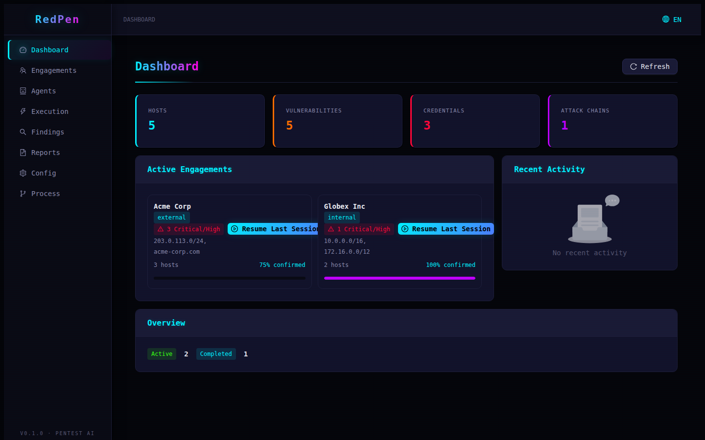
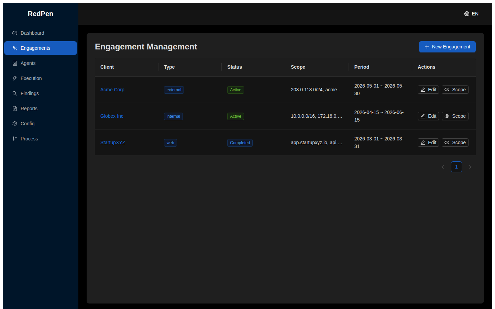
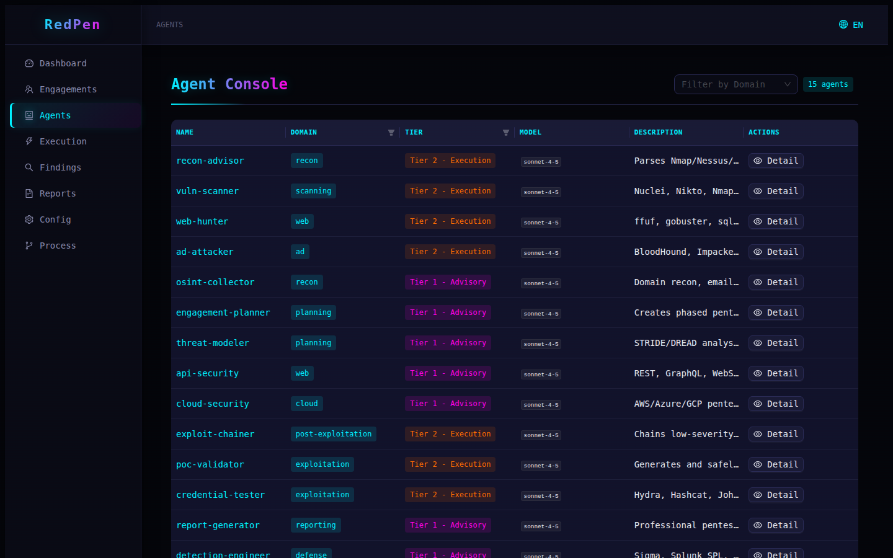
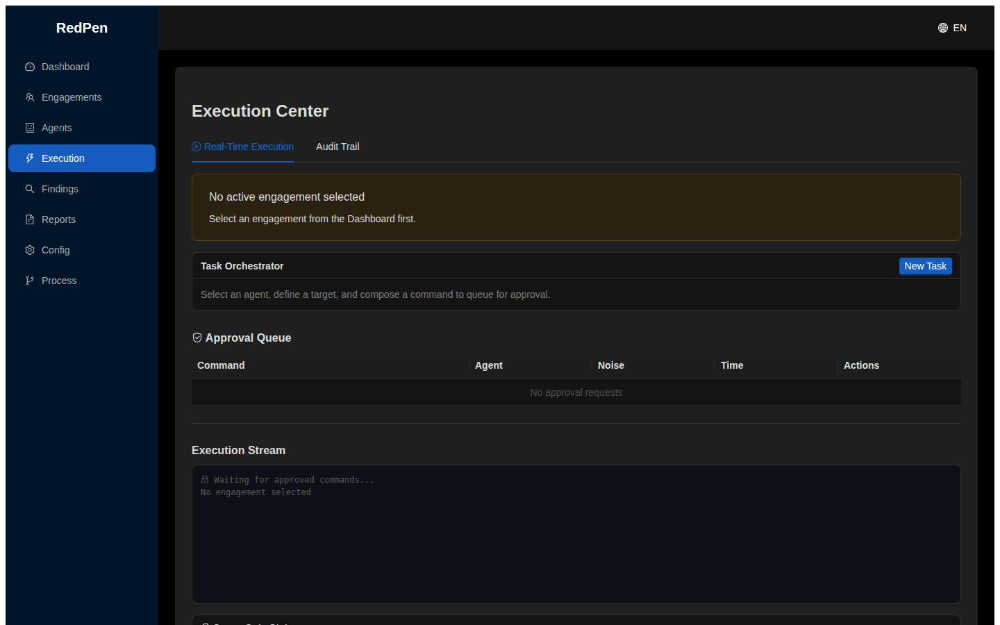
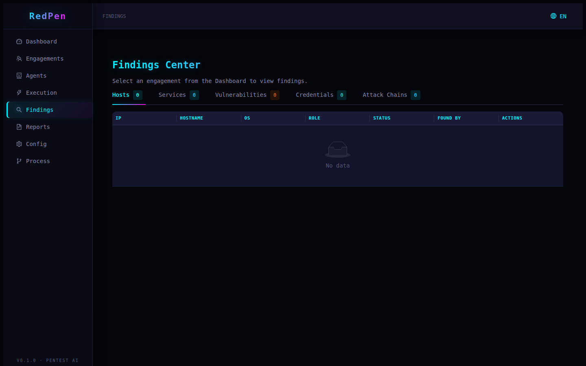
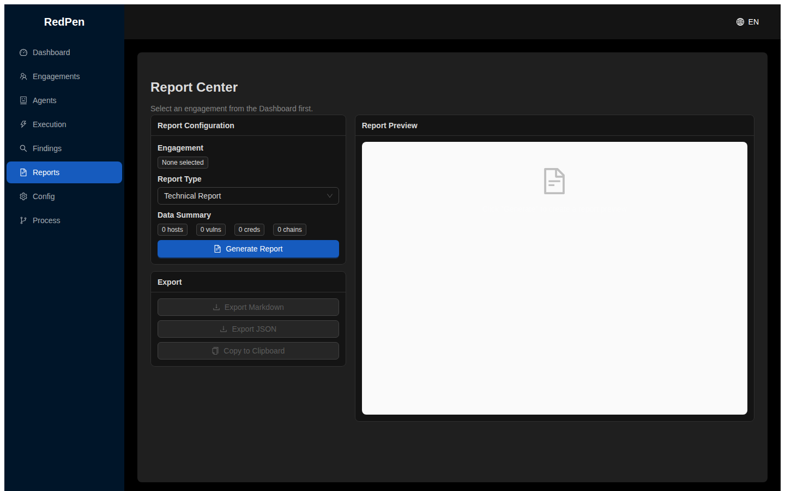
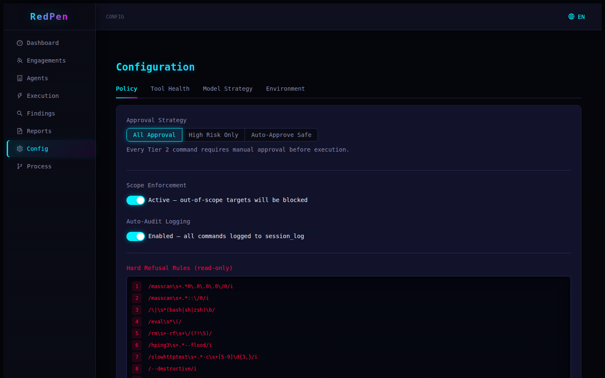
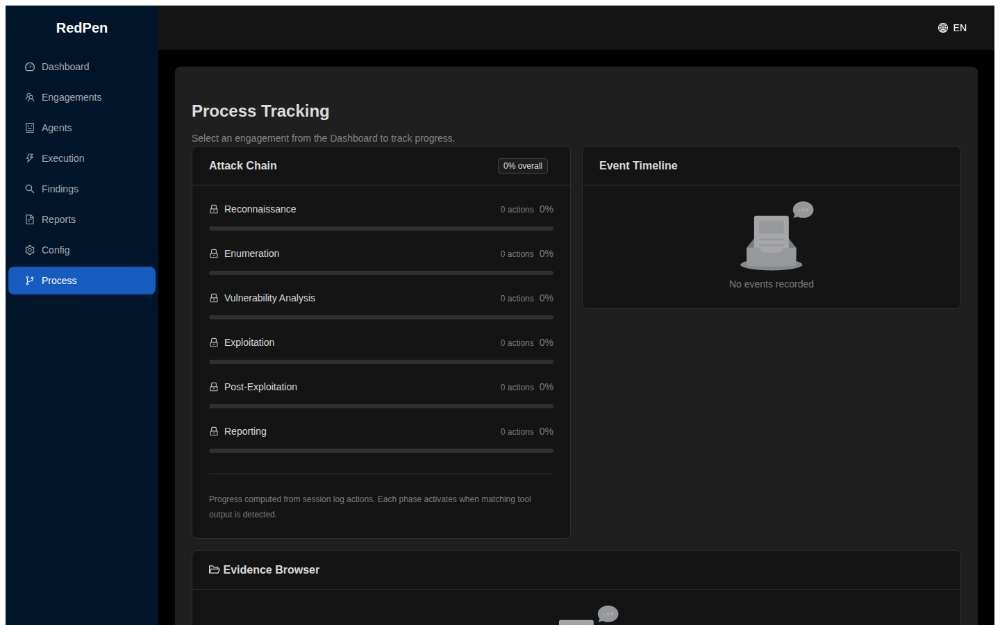

# RedPen

**Pentest AI Agent Platform** — 基于 35+ 渗透测试智能体的平台，提供 Scope-Gated 安全执行、SQLite 数据持久化和 8 模块 GUI 管理界面。



---

## 目录

- [项目背景](#项目背景)
- [核心特性](#核心特性)
- [架构概览](#架构概览)
- [Agent 体系](#agent-体系)
- [安全机制](#安全机制)
- [安装指南](#安装指南)
- [配置说明](#配置说明)
- [使用教程](#使用教程)
- [模块详解](#模块详解)
- [OpenCode 集成](#opencode-集成)
- [开发指南](#开发指南)
- [项目结构](#项目结构)
- [常见问题](#常见问题)
- [License](#license)

---

## 项目背景

RedPen 源自 [pentest-ai-agents](https://github.com/0xSteph/pentest-ai-agents) 项目。原项目定义了 35 个渗透测试 Claude Code 子代理，覆盖侦察、扫描、Web 安全、AD 攻防、云安全等 10 大领域，通过 CLI 方式运行。

RedPen 在此基础上进行了系统性改造：

| 维度 | 原项目 | RedPen |
|------|--------|--------|
| 交互方式 | CLI 命令行 | GUI 桌面应用 (React + Ant Design) |
| 安全控制 | 无 | Scope-Gate 插件（3 道防线） |
| 数据存储 | 文件系统 | SQLite (10 张表, WAL 模式) |
| 命令审批 | 无 | Operator 审批队列 |
| 平台兼容 | 仅 Claude Code | Claude Code + OpenCode |
| 国际化 | 英文 | 中/英双语 (i18next) |

---

## 核心特性

- **35+ 专业代理**：覆盖 10 大安全领域，双层架构（Tier 1 咨询 / Tier 2 执行）
- **Scope-Gate 安全执行**：CIDR/域名校验 + 10 条硬拦截规则 + 人工审批
- **8 模块 GUI**：Dashboard、Engagements、Agents、Execution、Findings、Reports、Config、Process
- **SQLite 持久化**：10 张表，WAL 模式，完整 CRUD + 统计 + 导出
- **自动报告生成**：Technical / Executive / Handoff 三种报告模板
- **OpenCode 兼容**：Converter CLI 一键转换 `.claude/` → `.opencode/`
- **中英双语**：i18next 国际化，侧边栏可切换语言
- **83 个测试**：smoke / security / regression 三层测试覆盖

---

## 架构概览

```
┌─────────────────────────────────────────────────────────┐
│                    React GUI (Vite)                      │
│                                                         │
│  Dashboard  │  Engagements  │  Agents   │  Execution    │
│  Findings   │  Reports      │  Config   │  Process      │
├─────────────────────────────────────────────────────────┤
│                Zustand Stores (状态管理)                  │
│  appStore │ engagementStore │ findingsStore │ agentStore │
├─────────────────────────────────────────────────────────┤
│               Main Process Services (IPC)                │
│  AgentService  │ ScopeService   │ ExecutionService      │
│  FindingsService │ ReportService │ IPC Handlers (40+)   │
├─────────────────────────────────────────────────────────┤
│                  Security Plugins                        │
│  ┌─────────────┐  ┌─────────────┐  ┌─────────────┐      │
│  │ scope-gate  │  │ cmd-audit   │  │session-sync │      │
│  │ (before)    │  │ (after)     │  │ (idle)      │      │
│  │ scope校验    │  │ 审计日志     │  │ handoff草稿  │      │
│  │ 硬拦截清单   │  │ 证据落盘     │  │ 统计快照     │      │
│  └─────────────┘  └─────────────┘  └─────────────┘      │
├─────────────────────────────────────────────────────────┤
│              SQLite (better-sqlite3, WAL mode)           │
│  engagements │ hosts │ services │ vulns │ credentials    │
│  chains │ session_log │ approvals │ task_state │ config  │
└─────────────────────────────────────────────────────────┘
```

---

## Agent 体系

### 双层架构

| 层级 | 名称 | 职责 | 审批要求 | 典型场景 |
|------|------|------|---------|---------|
| **Tier 1** | Advisory | 分析、规划、方法论指导 | 无需审批 | 情报收集、威胁建模、报告撰写 |
| **Tier 2** | Execution | 组合并执行渗透工具命令 | Scope 校验 + 人工审批 | 端口扫描、漏洞利用、密码破解 |

### 35+ 代理覆盖领域

| 领域 | 代理 | 层级 |
|------|------|------|
| 侦察 | recon-advisor, osint-collector, c2-operator | Tier 1/2 |
| 扫描 | vuln-scanner | Tier 2 |
| Web 安全 | web-hunter, api-security, bizlogic-hunter | Tier 1/2 |
| AD/内网 | ad-attacker, exploit-chainer, credential-tester | Tier 2 |
| 云安全 | cloud-security, container-breakout | Tier 1/2 |
| 防御/蓝队 | detection-engineer, malware-analyst, stig-analyst | Tier 1 |
| 社会工程 | social-engineer, phishing-operator | Tier 1/2 |
| 移动/IoT | mobile-pentester, wireless-pentester | Tier 1 |
| 报告 | report-generator, engagement-planner | Tier 1 |
| 规划 | threat-modeler | Tier 1 |

### Agent 文件格式

每个 Agent 为一个 Markdown 文件（`.claude/agents/{name}.md`），包含 YAML frontmatter：

```yaml
---
name: recon-advisor
description: Parses Nmap/Nessus/BloodHound output, prioritizes targets.
tools: [Bash, Read, Grep, Glob, WebFetch]
model: claude-sonnet-4-5-20250514
---

[Agent 指令正文]
```

---

## 安全机制

### Scope Gate — 三道防线

**第一道：目标校验**

所有 Tier 2 命令在执行前，scope-gate 插件会自动提取命令中的 IP、CIDR、域名，与当前 Engagement 声明的 scope 进行比对。不在 scope 内的目标会被拦截。

```
# Scope 声明示例
203.0.113.0/24
acme-corp.com
10.0.0.1

# 以下命令会被拦截（目标不在 scope 内）
nmap -sV 8.8.8.8          # 外部 IP
sqlmap -u https://google.com  # 外部域名
```

**第二道：硬拦截清单**

以下命令模式无论是否在 scope 内，一律直接拒绝：

| 模式 | 风险 |
|------|------|
| `masscan 0.0.0.0/0` | 全网扫描 |
| `\| bash` / `\| sh` | 管道注入 |
| `rm -rf /` | 系统破坏 |
| `hping3 --flood` | DoS 攻击 |
| `--destructive` | 危险标志 |
| `dd if=/dev/urandom of=` | 磁盘填充 |
| fork bomb (`:(){ :\|:& };:`) | 资源耗尽 |

**第三道：人工审批**

Tier 2 命令排队进入审批队列，Operator 在 GUI 中 review 命令内容、噪音级别后 approve 或 deny。

### 噪音分级

| 级别 | 说明 | 影响 | 颜色 |
|------|------|------|------|
| **QUIET** | 被动侦察，不发送数据包 | 不触发 IDS | 绿色 |
| **MODERATE** | 主动扫描，限速 | 可能产生日志 | 橙色 |
| **LOUD** | 激进扫描，高并发 | 很可能触发 IDS/告警 | 红色 |

### 命令审计

所有命令执行自动记录到 `session_log`，包含：

- 执行代理、命令文本、参数
- 执行状态：`executed` / `blocked` / `denied`
- 证据文件：`data/evidence/{engagement_id}/{tool}_{target}_{timestamp}.log`
- 关联到对应的 findings 记录

---

## 安装指南

### 系统要求

| 依赖 | 最低版本 | 推荐版本 | 用途 |
|------|---------|---------|------|
| Node.js | 18.0 | 20.x LTS | 运行时 |
| npm | 9.0 | 10.x | 包管理 |
| Git | 2.0 | 最新 | 版本控制 |
| 操作系统 | - | Linux / macOS / Windows | 运行环境 |

### 步骤一：克隆仓库

```bash
git clone https://github.com/wolf0x/redpen.git
cd redpen
```

### 步骤二：安装依赖

```bash
npm install
```

等待安装完成（约 1-2 分钟，取决于网络速度）。

> **注意**：如果 `better-sqlite3` 编译失败，需要安装构建工具：
> - Ubuntu/Debian: `sudo apt install build-essential python3`
> - macOS: `xcode-select --install`
> - Windows: `npm install --global windows-build-tools`

### 步骤三：启动开发服务器

```bash
npm run dev
```

终端输出类似：

```
  VITE v6.4.2  ready in 673 ms

  ➜  Local:   http://localhost:5173/
```

打开浏览器访问 **http://localhost:5173** 即可看到 RedPen 界面。

### 步骤四：验证安装

```bash
# 运行全部测试（83 个）
npm test

# 预期输出：
# ✓ tests/smoke/agent-loading.test.ts (42 tests)
# ✓ tests/smoke/db-writes.test.ts (6 tests)
# ✓ tests/security/scope-rejection.test.ts (10 tests)
# ✓ tests/security/dangerous-pattern.test.ts (15 tests)
# ✓ tests/regression/converter-output.test.ts (6 tests)
# ✓ tests/regression/tier-flow.test.ts (4 tests)
# Test Files  6 passed (6)
#       Tests  83 passed (83)
```

### 步骤五：构建生产版本（可选）

```bash
npm run build
# 输出到 dist/renderer/ 目录
```

---

## 配置说明

### 数据目录

RedPen 的数据存储在项目根目录的 `data/` 文件夹下：

```
data/
├── redpen.db           # SQLite 数据库（WAL 模式）
├── evidence/           # 命令输出证据
│   └── {engagement_id}/
│       └── {tool}_{target}_{timestamp}.log
├── handoffs/           # Session handoff 报告
│   └── {engagement_id}/
│       └── handoff_{timestamp}.md
└── agent-versions/     # Agent 配置版本历史
    └── {agent_name}/
        └── v{N}.md
```

> 数据目录在 `.gitignore` 中，不会提交到仓库。

### 数据库配置

SQLite 数据库使用 WAL (Write-Ahead Logging) 模式，支持并发读取。Schema 位于 `db/schema.sql`，包含 10 张表：

| 表名 | 用途 |
|------|------|
| `engagements` | 渗透测试项目 |
| `hosts` | 发现的目标主机 |
| `services` | 主机上发现的服务 |
| `vulns` | 发现的漏洞 |
| `credentials` | 获取的凭据 |
| `chains` | 攻击链 |
| `session_log` | 操作审计日志 |
| `approvals` | 命令审批队列 |
| `task_state` | 执行任务状态 |
| `config_versions` | 配置版本历史 |

### 审批策略配置

在 Config → Policy 页面配置：

| 策略 | 说明 | 适用场景 |
|------|------|---------|
| **All Approval** | 所有 Tier 2 命令需人工审批 | 高风险环境、首次测试 |
| **High Risk Only** | 仅 LOUD 级别需审批，MODERATE/QUIET 自动通过 | 日常测试 |
| **Auto-Approve Safe** | 匹配安全模式的命令自动通过 | 内部测试环境 |

### 渗透工具配置

RedPen 本身不包含渗透工具，但 Config → Tool Health 页面会扫描以下工具的安装状态：

**必需工具（核心功能）**：
- `nmap` — 端口扫描和服务识别
- `nuclei` — 漏洞扫描

**推荐工具（增强功能）**：
- `sqlmap` — SQL 注入自动化
- `ffuf` / `gobuster` — 目录/文件爆破
- `bloodhound` / `impacket` — AD 攻防
- `hydra` / `hashcat` / `john` — 密码破解
- `shodan` — 互联网资产搜索
- `nikto` — Web 漏洞扫描
- `dalfox` — XSS 自动化

安装缺失工具：

```bash
# Ubuntu/Debian 示例
sudo apt install nmap nikto hydra john

# Nuclei
go install -v github.com/projectdiscovery/nuclei/v3/cmd/nuclei@latest

# SQLMap
pip install sqlmap

# ffuf
go install github.com/ffuf/ffuf/v2@latest

# BloodHound (需要 Neo4j)
# 参考 https://github.com/BloodHoundAD/BloodHound
```

### 国际化配置

RedPen 支持中文和英文，翻译文件位于：

- `src/renderer/i18n/en.json` — 英文（默认）
- `src/renderer/i18n/zh.json` — 中文

切换语言：点击顶部导航栏右侧的语言按钮即可切换，选择会保存到 localStorage。

---

## 使用教程

### 典型工作流程

```
创建 Engagement → 声明 Scope → 选择 Agent → 排队命令 → 审批 → 执行 → 查看发现 → 生成报告
```

### 第一步：创建渗透测试项目（Engagement）

1. 点击左侧导航栏 **Engagements**
2. 点击右上角 **New Engagement** 按钮
3. 填写表单：
   - **Client**：客户名称（如 "Acme Corp"）
   - **Type**：测试类型（External / Internal / Web / Cloud / Wireless / Red Team）
   - **Scope**：目标范围，每行一个 IP/CIDR/域名
     ```
     203.0.113.0/24
     acme-corp.com
     vpn.acme-corp.com
     ```
   - **Rules of Engagement**：禁止事项（如 "No DoS, no social engineering"）
   - **Period**：测试时间段
   - **Status**：设为 **Active**
4. 点击 **OK** 保存

### 第二步：激活 Engagement 为当前工作目标

在 Dashboard 的活跃 Engagement 卡片上，点击 **Resume** 按钮。此时系统会自动将该 Engagement 设为全局上下文，后续所有操作都关联到此项目。

### 第三步：查看可用 Agent

1. 点击左侧导航栏 **Agents**
2. 浏览 35+ Agent 列表，可通过 Domain 和 Tier 筛选
3. 点击任一 Agent 名称，查看详情（工具列表、Prompt 预览）

### 第四步：在 Execution Center 排队命令

1. 点击左侧导航栏 **Execution**
2. 在 **Real-Time Execution** Tab 中，点击 **New Task**
3. 选择 Agent（仅 Tier 2 Agent 可执行命令）
4. 输入命令，例如：
   ```
   nmap -sV -p 1-1000 203.0.113.0/24
   ```
5. 选择噪音级别（QUIET / MODERATE / LOUD）
6. 点击 **OK** 提交

### 第五步：审批命令

1. 命令提交后进入 **Approval Queue**
2. 查看命令详情：Agent、命令文本、噪音级别
3. 点击 **Approve** 执行，或 **Deny** 拒绝
4. 审批结果实时反映在执行流中

### 第六步：查看发现（Findings）

1. 点击左侧导航栏 **Findings**
2. 在 5 个 Tab 中查看不同类型的发现：

**Hosts**：发现的主机，点击 IP 查看详情

**Services**：端口和服务信息

**Vulnerabilities**：漏洞列表
- 支持批量操作：勾选多个漏洞 → 选择状态 → Apply
- 支持按严重程度排序
- 点击漏洞标题查看详情（描述、PoC、MITRE ATT&CK ID）

**Credentials**：获取的凭据（密码、哈希、Token）

**Attack Chains**：攻击链可视化，展示从初始访问到完全控制的完整路径

### 第七步：生成报告

1. 点击左侧导航栏 **Reports**
2. 选择报告类型：
   - **Technical Report**：完整技术报告（详细发现 + PoC + 修复建议）
   - **Executive Summary**：高管摘要（风险评级 + 关键发现 + 建议）
   - **Handoff Report**：交接报告（当前状态 + 待办事项）
3. 点击 **Generate Report**
4. 预览区显示生成的 Markdown 报告
5. 点击 **Export Markdown** / **Export JSON** 下载文件

### 第八步：过程追踪

1. 点击左侧导航栏 **Process**
2. 查看 6 阶段攻击链进度（系统根据 Session Log 自动计算）
3. 完整事件时间线显示每条命令的执行详情
4. 证据浏览器列出所有命令输出文件

---

## 模块详解

### 1. Dashboard（仪表盘）


| 功能 | 说明 |
|------|------|
| 统计卡片 | Hosts / Vulns / Credentials / Attack Chains 总数 |
| 活跃 Engagement 卡片 | 客户名、类型、风险分布、确认率、攻击链完成度 |
| Resume 按钮 | 一键激活 Engagement 并跳转到 Execution Center |
| 最近活动 | Session Log 时间线（最近 10 条） |
| 状态分布 | 按状态统计 Engagement 数量 |

### 2. Engagements（项目管理）



| 功能 | 说明 |
|------|------|
| 项目列表 | 客户、类型、状态、Scope、时间 |
| 新建/编辑 | Modal 表单，支持客户、类型、Scope、ROE、日期、状态 |
| Scope 编辑器 | Drawer 组件，输入 IP/CIDR/域名，实时解析并显示绿色（有效）/ 红色（无效）标签 |
| 激活 | 点击客户名设为当前 Engagement |

### 3. Agents（代理控制台）



| 功能 | 说明 |
|------|------|
| Agent 列表 | 名称、Domain、Tier、模型、描述 |
| 筛选 | 按 Domain 和 Tier 过滤 |
| 详情抽屉 | 完整信息：描述、Tier、Domain、模型、工具列表、Prompt 预览 |

### 4. Execution Center（执行中心）



| 功能 | 说明 |
|------|------|
| Task Orchestrator | 组合 Agent + Command + Noise Level 创建任务 |
| Approval Queue | 待审批命令列表，支持 Approve/Deny |
| Execution Stream | 实时执行日志（终端风格） |
| Scope Gate Status | 显示当前 Scope 校验状态和声明的 Scope |
| 审计追踪 Tab | 已解决的审批记录 + Session Log 完整时间线 |

### 5. Findings Center（发现中心）



| 功能 | 说明 |
|------|------|
| 5 Tab 视图 | Hosts / Services / Vulns / Credentials / Attack Chains |
| 批量操作 | Vuln Tab 支持勾选多条 → 批量更新状态 |
| 详情抽屉 | CVSS、CVE、MITRE ATT&CK、描述、PoC 输出 |
| 攻击链详情 | 步骤可视化（phase + action + MITRE ID） |

### 6. Report Center（报告中心）



| 功能 | 说明 |
|------|------|
| 报告配置 | 选择 Engagement + 报告类型 |
| 报告生成 | 基于当前数据自动生成 Markdown |
| 实时预览 | 终端风格预览区 |
| 导出 | Markdown / JSON 下载 + 剪贴板复制 |

### 7. Config Center（配置中心）



| Tab | 功能 |
|-----|------|
| Policy | 审批策略选择、Scope 强制开关、Auto-Audit 开关、硬拦截规则展示、Tier 2 Agent 列表 |
| Tool Health | 15+ 渗透工具安装状态扫描（绿色已安装 / 红色缺失） |
| Model Strategy | 各 Agent 的模型和预估单次运行成本 |
| Environment | 证据路径、数据库路径、本地模型端点配置 |

### 8. Process Tracking（过程追踪）



| 功能 | 说明 |
|------|------|
| 攻击链进度 | 6 阶段进度条（Recon → Enum → Vuln Analysis → Exploitation → Post-Exploitation → Reporting），基于 Session Log 自动计算 |
| 事件时间线 | 完整命令历史，含详细命令和执行状态 |
| 证据浏览器 | 所有命令输出文件列表 |

---

## OpenCode 集成

RedPen 可以将 Claude Code 格式的 Agent 文件转换为 OpenCode 兼容格式。

### 转换

```bash
npm run converter
```

### 生成文件

```
.opencode/
├── agents/
│   ├── recon-advisor.md
│   ├── vuln-scanner.md
│   └── ... (34 个 agent 文件)
├── commands/
│   ├── agents-for.md
│   ├── recommend.md
│   └── memory.md
├── migration-report.json  # 转换报告
└── opencode.json          # OpenCode 配置
```

### 转换规则

- frontmatter 字段标准化：`name` → `agent`, `description` 保留, 新增 `subtask`
- `_scope-guard.md` 被跳过（安全边界文件，不进入 OpenCode）
- `opencode.json` 自动配置插件路径和指令引用

### 安装到 OpenCode

```bash
# 全局安装
npx tsx scripts/opencode-installer.ts --global

# 项目级安装
npx tsx scripts/opencode-installer.ts --project
```

---

## 开发指南

### 可用脚本

| 命令 | 说明 |
|------|------|
| `npm run dev` | 启动 Vite 开发服务器（默认 http://localhost:5173） |
| `npm run build` | 构建生产版本到 `dist/renderer/` |
| `npm test` | 运行全部测试（83 个） |
| `npm run test:watch` | 监听模式，文件变更自动重跑 |
| `npm run converter` | 执行 `.claude/` → `.opencode/` 格式转换 |
| `npx tsx scripts/screenshot.ts` | 自动截取 8 个页面的截图 |
| `npx tsx scripts/parse-agents-meta.ts` | 解析 agent 元数据生成 JSON |

### 测试

```bash
# 运行全部测试
npm test

# 运行特定测试文件
npx vitest run tests/security/scope-rejection.test.ts

# 监听模式
npm run test:watch
```

测试分为三层：

| 层级 | 目录 | 测试数 | 覆盖内容 |
|------|------|--------|---------|
| Smoke | `tests/smoke/` | 48 | Agent 加载、DB 写入 |
| Security | `tests/security/` | 25 | Scope 拒绝、危险模式拦截 |
| Regression | `tests/regression/` | 10 | Converter 输出、Tier 流程 |

### 添加新 Agent

1. 在 `.claude/agents/` 创建 `{name}.md` 文件
2. 添加 YAML frontmatter：
   ```yaml
   ---
   name: my-agent
   description: Agent 功能描述
   tools: [Bash, Read, Grep]
   model: claude-sonnet-4-5-20250514
   ---
   ```
3. 编写 Agent 指令正文
4. 运行 `npm run converter` 同步到 `.opencode/`
5. 运行 `npm test` 验证

---

## 项目结构

```
redpen/
├── .claude/
│   ├── agents/               # 35+ Agent 定义文件 (YAML frontmatter)
│   │   ├── recon-advisor.md
│   │   ├── vuln-scanner.md
│   │   ├── web-hunter.md
│   │   ├── ad-attacker.md
│   │   ├── _scope-guard.md   # 安全边界（不转换）
│   │   └── ...
│   └── commands/
│       ├── recommend.md      # Agent 推荐命令
│       ├── agents-for.md     # 任务匹配命令
│       └── memory.md         # 记忆管理命令
│
├── .opencode/                # Converter 生成的 OpenCode 兼容格式
│   ├── agents/
│   ├── commands/
│   ├── migration-report.json
│   └── opencode.json
│
├── db/
│   └── schema.sql            # SQLite Schema（10 表 + 索引 + 约束）
│
├── scripts/
│   ├── converter-cli.ts      # .claude/ → .opencode/ 转换器
│   ├── parse-agents-meta.ts  # Agent 元数据解析
│   ├── opencode-installer.ts # OpenCode 安装脚本
│   └── screenshot.ts         # 自动截图脚本
│
├── screenshots/              # 8 模块截图
│   ├── dashboard.png
│   ├── engagements.png
│   ├── agents.png
│   ├── execution.png
│   ├── findings.png
│   ├── reports.png
│   ├── config.png
│   └── process.png
│
├── src/
│   ├── main/                 # Electron 主进程（可选）
│   │   ├── index.ts          # 入口
│   │   ├── preload.ts        # IPC Bridge
│   │   ├── ipc-handlers.ts   # 40+ IPC 通道
│   │   └── services/
│   │       ├── AgentService.ts       # Agent 加载/更新/版本历史
│   │       ├── DatabaseService.ts    # SQLite 单例 CRUD
│   │       ├── ExecutionService.ts   # 命令队列/执行/审计
│   │       ├── FindingsService.ts    # 发现 CRUD/批量操作
│   │       ├── ReportService.ts      # 报告生成/导出
│   │       └── ScopeService.ts       # Scope 解析/校验/冲突检测
│   │
│   ├── plugins/              # 安全插件
│   │   ├── scope-gate.ts     # Scope 校验 + 硬拦截（tool.execute.before）
│   │   ├── cmd-audit.ts      # 命令审计 + 证据落盘（tool.execute.after）
│   │   ├── session-sync.ts   # 会话快照 + handoff 草稿（session.idle）
│   │   └── types.ts          # 插件接口定义
│   │
│   ├── renderer/             # React 前端
│   │   ├── App.tsx           # 路由 + 侧边栏布局
│   │   ├── main.tsx          # React 入口
│   │   ├── api/
│   │   │   └── mockData.ts   # Mock 数据（纯前端模式）
│   │   ├── i18n/
│   │   │   ├── index.ts      # i18next 初始化
│   │   │   ├── en.json       # 英文翻译
│   │   │   └── zh.json       # 中文翻译
│   │   ├── pages/
│   │   │   ├── Dashboard.tsx
│   │   │   ├── Engagement.tsx
│   │   │   ├── AgentConsole.tsx
│   │   │   ├── ExecutionCenter.tsx
│   │   │   ├── FindingsCenter.tsx
│   │   │   ├── ReportCenter.tsx
│   │   │   ├── ConfigCenter.tsx
│   │   │   └── ProcessTracking.tsx
│   │   └── stores/
│   │       ├── appStore.ts          # 全局状态（语言、当前 Engagement）
│   │       ├── engagementStore.ts   # Engagement CRUD + 统计
│   │       ├── findingsStore.ts     # Findings CRUD + 审批
│   │       └── agentStore.ts        # Agent 加载 + 筛选
│   │
│   └── shared/
│       ├── types.ts           # TypeScript 接口定义
│       └── constants.ts       # 常量（噪音级别、严重程度颜色、硬拦截规则等）
│
├── tests/
│   ├── smoke/
│   │   ├── agent-loading.test.ts     # 42 个 Agent 加载测试
│   │   └── db-writes.test.ts         # 6 个数据库写入测试
│   ├── security/
│   │   ├── scope-rejection.test.ts   # 10 个 Scope 拒绝测试
│   │   └── dangerous-pattern.test.ts # 15 个危险模式拦截测试
│   └── regression/
│       ├── converter-output.test.ts  # 6 个 Converter 输出测试
│       └── tier-flow.test.ts         # 4 个 Tier 流程测试
│
├── AGENTS.md                 # 顶层 Agent 指令
├── opencode.json             # OpenCode 配置
├── package.json
├── tsconfig.json
├── tsconfig.node.json
├── vite.config.ts
└── vitest.config.ts
```

---

## 技术栈

| 层级 | 技术 | 版本 | 用途 |
|------|------|------|------|
| 前端框架 | React | 18.x | UI 组件 |
| 语言 | TypeScript | 5.7+ | 类型安全 |
| 构建工具 | Vite | 6.x | 开发服务器 + 打包 |
| UI 库 | Ant Design | 5.22+ | 组件库 |
| 图标 | @ant-design/icons | 5.5+ | 图标 |
| 状态管理 | Zustand | 5.x | 轻量状态管理 |
| 路由 | react-router-dom | 6.28+ | 页面路由 |
| 国际化 | i18next + react-i18next | 23.x / 15.x | 中英双语 |
| 数据库 | better-sqlite3 | 11.6+ | SQLite WAL |
| 日期处理 | dayjs | 1.11+ | 日期格式化 |
| Markdown 解析 | marked | 15.x | 报告渲染 |
| IP 处理 | ip-cidr | 4.x | CIDR 校验 |
| YAML 解析 | gray-matter | 4.x | Agent frontmatter 解析 |
| 测试 | Vitest | 2.1+ | 单元测试 |

---

## 常见问题

### Q: npm install 报错 `better-sqlite3` 编译失败？

需要安装 C++ 构建工具：
```bash
# Ubuntu/Debian
sudo apt install build-essential python3

# macOS
xcode-select --install

# Windows (以管理员身份运行 PowerShell)
npm install --global windows-build-tools
```

### Q: 端口 5173 被占用？

Vite 会自动尝试下一个端口（5174、5175...）。也可以手动指定：
```bash
npx vite --port 3000
```

### Q: 如何切换到 Electron 模式？

当前为纯前端模式（Vite dev server）。如需 Electron 桌面模式：
```bash
npm install --save-dev electron electron-builder concurrently wait-on
# 修改 package.json scripts:
# "dev": "concurrently \"vite\" \"wait-on http://localhost:5173 && electron .\""
```

### Q: 如何连接真实数据库？

当前前端使用 mock 数据。连接真实 SQLite 需要：
1. 启用 Electron 主进程
2. 通过 IPC 调用 `DatabaseService`
3. stores 中将 mock 调用替换为 `window.electronAPI.db.*`

### Q: Agent 文件放在哪里？

Agent 定义文件在 `.claude/agents/` 目录下，每个 Agent 一个 Markdown 文件。运行 `npm run converter` 可同步到 `.opencode/agents/`。

### Q: 如何自定义硬拦截规则？

编辑 `src/shared/constants.ts` 中的 `HARD_REFUSAL_PATTERNS` 数组，添加正则表达式即可。

---

## License

MIT
